# OnePlus 6T Arch Linux ARM Installer

Turn a OnePlus 6T into a real Linux phone you can inspect, repair, change, and
own.

This project is for people who look at modern smartphones and think: why is the
computer in my pocket locked behind someone else's rules? A Linux phone is not
just another launcher or another theme. It is a pocket computer with a real
userspace, real package management, real shell access, real logs, real services,
and a desktop stack you can change instead of begging a vendor for permission.

There is no app-store walled garden here. No mystery update channel deciding
what you are allowed to run. No artificial split between "phone" and "computer".
The OnePlus 6T becomes a small Linux workstation with a touchscreen, modem,
Wi-Fi, Bluetooth, sensors, audio, GPU support, and a Wayland desktop. You can SSH
into it, read the boot logs, swap packages, rebuild the image, patch services,
and learn how the device actually works.

This is the **community edition** of the installer: a public, reproducible build
path for people who want to try Linux on real phone hardware and help push the
open mobile stack forward.


## Why This Exists

The OnePlus 6T is old enough to be inexpensive, powerful enough to be useful,
and well-supported enough by mainline-adjacent SDM845 work to be a serious
Linux-phone proving ground. This repository turns that into something people
can actually run:

- a repeatable install path rather than a private lab image
- a clear hardware feature map rather than vague screenshots
- a conservative default kernel rather than crash-prone research features
- documented CLI primitives for people building their own phone UI
- a public profile that avoids private credentials and personal setup files
- an open base people can inspect, fork, film, test, and improve

With an open Linux phone you can:

- run normal Linux tools instead of waiting for mobile app wrappers
- inspect services, logs, devices, firmware paths, and hardware state directly
- automate the phone from shell scripts, systemd units, SSH, and package hooks
- build your own phone UI instead of accepting one vendor's idea of "mobile"
- keep old flagship hardware useful instead of throwing it away
- test modem, audio, sensors, input, GPU, and desktop components in the open
- use the phone as a development board, pocket terminal, travel computer, or
  daily experiment

Project website:

```text
https://www.tonimcqueen.com
```

Longer-term technical notes live under `docs/`. The README focuses on
installing and understanding this OnePlus 6T community image.

## Visual Summary

The first image sells the idea: Linux on real mobile hardware, not a locked
consumer appliance. The second image shows the public/community line against
the sponsored development line.

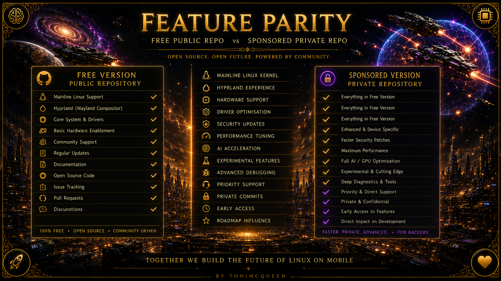

### Project Visual Gallery

These visuals are campaign assets for explaining the wider idea: Linux on real
phone hardware, a community build anyone can inspect, and a sponsored line that
helps fund faster development.

<p align="center">
  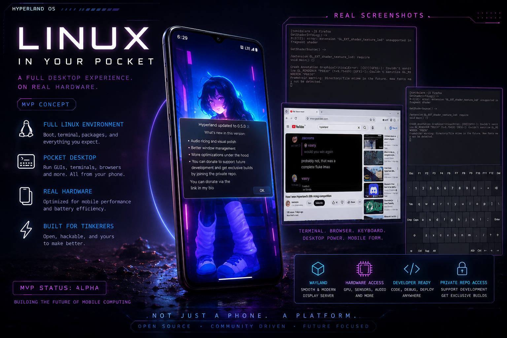
</p>

<p align="center">
  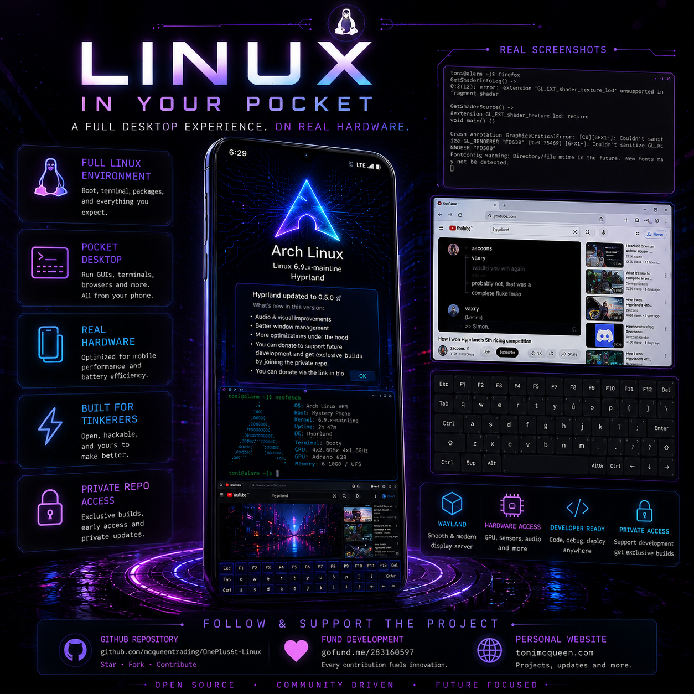
  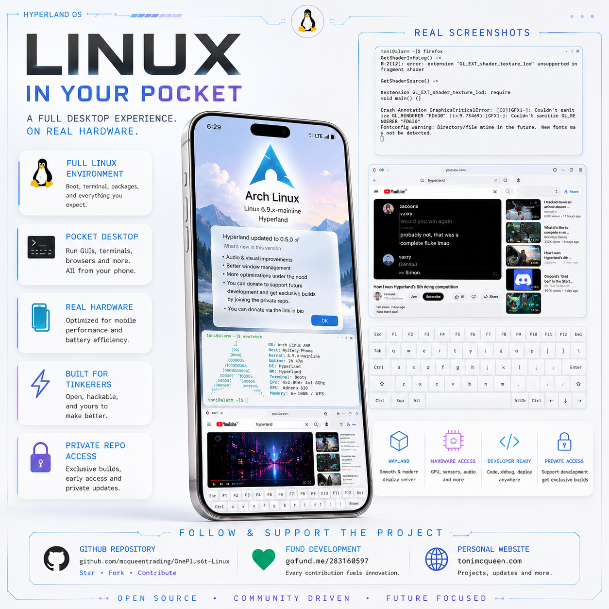
</p>

<details>
<summary>Technical community build diagrams</summary>

Community install flow:


Community hardware/software map:

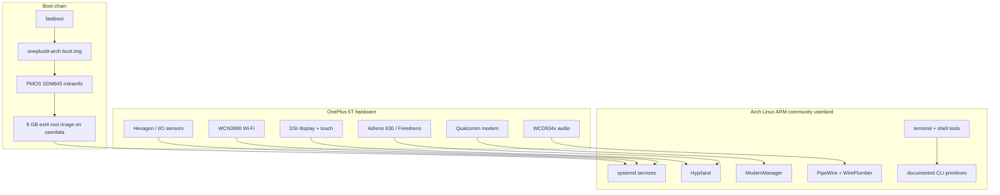

</details>

## What You Get

The community build is intentionally open and practical:

- Arch Linux ARM root filesystem for `aarch64`
- PMOS SDM845 OnePlus 6T boot stack
- Hyprland Wayland desktop
- Qualcomm firmware package path
- Wi-Fi, Bluetooth, audio, sensors, modem tooling, and mobile data/SMS tools
- Plymouth quiet boot theme
- fastboot-friendly boot and userdata images
- scripts for checking the phone, building the image, and flashing it
- documentation for the device profile, partition layout, recovery path, and
  hardware notes

This is not pretending to be a polished commercial phone OS. It is a real,
hackable Linux base that shows the path from stock Android hardware to an open
phone stack.

## Community And Sponsored Development

The free public repository is the community path: open code, reproducible
builds, documentation, and enough of the stack to let people try the idea for
themselves.

Sponsored development helps fund the work needed to push further: more testing
hardware, replacement parts, hosting, documentation, phone/audio routing,
camera experiments, UI polish, installer refinement, and the next stage toward a
more capable open Linux phone experience.

Support future work:

- GitHub Sponsors: use the sponsor button on this repository
- GoFundMe: <https://gofund.me/283160597>
- Project site: <https://www.tonimcqueen.com>

The goal is bigger than one installer. This is a stepping stone toward a more
open smartphone ecosystem where users can choose, repair, modify, and understand
their own devices.

## Bootloader Unlock Quick Guide

You must unlock the OnePlus 6T bootloader before this installer can flash the
phone. Unlocking the bootloader wipes Android user data.


On stock Android/OxygenOS:

1. Open `Settings`.
2. Go to `About phone`.
3. Tap `Build number` seven times until Android says Developer options are
   enabled.
4. Go back to `Settings -> System -> Developer options`.
5. Enable `OEM unlocking`.
6. Optional but convenient: enable `USB debugging`.
7. Reboot the phone into fastboot mode.

From the Linux host:

```text
fastboot devices -l
fastboot getvar product
fastboot oem unlock
```

Read the warning on the phone, use the volume keys to select the unlock option,
and confirm with the power key. Some bootloaders use:

```text
fastboot flashing unlock
```

After the phone wipes itself, return to fastboot mode before running the
installer. Do not relock the bootloader while this image is installed.

## Fast Install Path

If the bootloader is already unlocked and the phone is already in fastboot mode,
the community install path is intentionally plain:

```text
git clone https://github.com/mcqueentrading/OnePlus6t-Linux
cd OnePlus6t-Linux
scripts/check-phone.sh
doas scripts/build-release.sh oneplus-fajita
CONFIRM_FLASH=1 scripts/flash-release.sh oneplus-fajita
```

Use `sudo` instead of `doas` if that is how your host grants root:

```text
sudo scripts/build-release.sh oneplus-fajita
CONFIRM_FLASH=1 sudo scripts/flash-release.sh oneplus-fajita
```

The build step needs host root because it creates and mounts an ext4 filesystem
image. The flash step may also need host root depending on your fastboot/udev
setup.

`scripts/check-phone.sh` is read-only. It only checks host tools, USB, ADB, and
fastboot visibility:

```text
scripts/check-phone.sh
```

The destructive phone flash happens only when `CONFIRM_FLASH=1` is present.
Without that variable, `scripts/flash-release.sh` refuses to write.

## Current Community Installer Contract

The community edition is deliberately simple and reproducible. It gives people a
working public base, while avoiding the more automated private installer flow.

This repository builds:

```text
out/oneplus-fajita/oneplus6t-arch-boot.img
out/oneplus-fajita/oneplus6t-arch-root.img
```

Current community defaults:

```text
ROOT_DEVICE=/dev/sda17
ROOT_LABEL=archroot
ROOT_UUID=8f3b0c30-9845-451d-aed4-7e80541a0d29
ROOT_IMAGE_SIZE=8G
ROOT_FSTYPE=ext4
FASTBOOT_SPARSE_SIZE=0
ALLOW_INSECURE_DEFAULT_PASSWORD=0
```

What this means:

| Area | Community edition behavior |
| --- | --- |
| Root filesystem | Fixed 8 GB `ext4` image |
| Userdata size | Does not expand to full 128 GB/256 GB userdata |
| Package selection | Edit `profiles/oneplus-fajita/packages.txt` before build |
| Account setup | Uses the committed profile; no interactive username prompt |
| Password policy | Password login disabled unless explicitly enabled for local testing |
| Wi-Fi setup | No interactive Wi-Fi prompt |
| Mobile APN setup | No interactive APN prompt |
| Flash chunking | Uses fastboot default chunking, not the smaller sponsored 16M path |
| Verification handling | Does not write `vbmeta` by default |
| Filesystem safety | No Btrfs full-userdata path; no ext4 clean-stage path |
| Kernel policy | Conservative PMOS 6.9 SDM845 default |
| Camera policy | Camera research excluded from default community image |

Build and flash sequence:

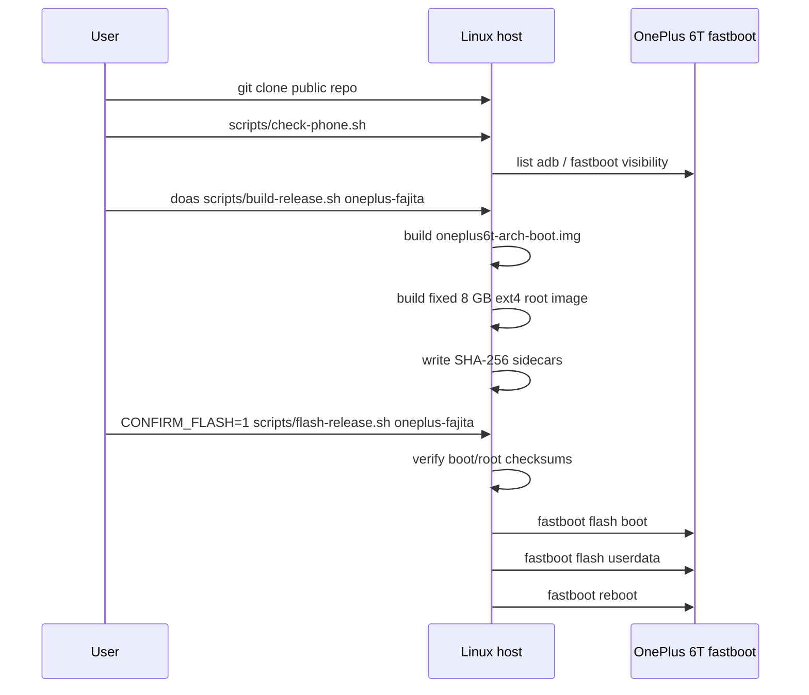

Community versus sponsored setup shape:

| Setup choice | Community edition | Sponsored development edition |
| --- | --- | --- |
| Repo access | Public | Private sponsor repo |
| Root filesystem | Fixed 8 GB `ext4` | Full-size userdata `Btrfs` |
| Userdata sizing | Static profile value | Detected from attached phone |
| Flash chunking | Fastboot default | PMOS-style 16M sparse chunks |
| Package changes | Edit `packages.txt` manually | Interactive package review prompt |
| First-boot setup | Committed defaults | Optional user/password/Wi-Fi/APN prompts |
| Camera research | Excluded | Tracked as opt-in lab work |
| Goal | Public proving ground | Faster integration and validation |

For throwaway local test images only, you can enable temporary root password
login while building:

```text
ALLOW_INSECURE_DEFAULT_PASSWORD=1 doas scripts/build-release.sh oneplus-fajita
```

That creates the development password path described by the profile. Do not use
that setting for a public or shared device.

The package manifest is plain text:

```text
profiles/oneplus-fajita/packages.txt
```

Add or remove package names there before building if you want a different
community image. This tree does not include the sponsored package-review prompt.

## What The Installer Touches

The installer is destructive to Android user data. It is deliberately narrow
about the partitions it writes.

| Target | Written by default | Why |
| --- | --- | --- |
| active-slot boot | yes | boots the PMOS SDM845 kernel/initramfs handoff |
| userdata | yes | stores the Arch Linux ARM ext4 root image |
| active-slot vbmeta | no | community script does not alter verified-boot metadata |
| dtbo | no | keeps device-tree overlays intact |
| modem | no | keeps radio firmware intact |
| vendor | no | keeps stock vendor partitions intact |
| persist | no | keeps calibration/provisioning data intact |
| modemst1/modemst2/fsg/fsc | no | keeps radio/NV state intact |

Public partition write map:

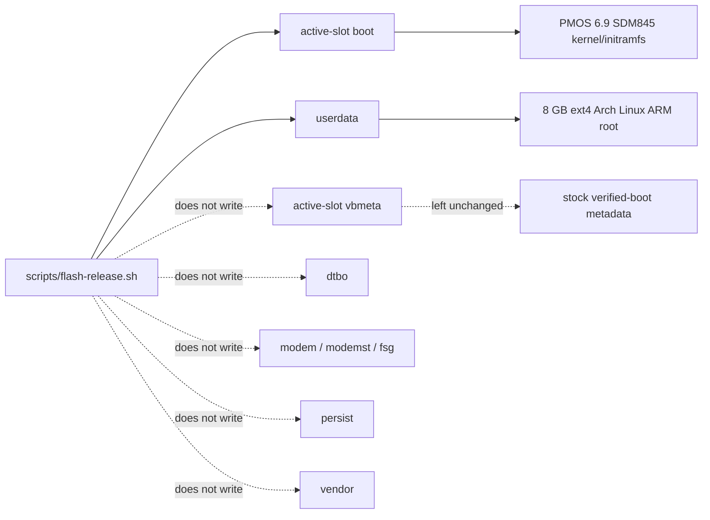

The phone is not flashed until you run:

```text
CONFIRM_FLASH=1 scripts/flash-release.sh oneplus-fajita
```

## Before You Flash: Fastboot And EDL Notes

This installer expects a OnePlus 6T with an unlocked bootloader and a working
USB fastboot connection. Confirm fastboot can really talk to the phone before
running any installer:

```text
fastboot devices -l
fastboot getvar product
fastboot getvar partition-size:userdata
```

If Android boots and USB debugging is enabled, you can enter fastboot with:

```text
adb devices
adb reboot bootloader
```

If Android does not boot, power the phone off, then hold `Volume Up + Power`
until the OnePlus fastboot/bootloader screen appears. On the OnePlus 6/6T,
`Volume Down + Power` usually enters recovery instead, not fastboot.

Carrier-locked variants, especially some US T-Mobile OnePlus 6T models, can
require an unlock token before `fastboot oem unlock` will work. Treat MSM/EDL
conversion guides as a separate recovery project, not a normal install step.

Qualcomm EDL mode is not required by this installer. It is useful for recovery
and read-only backups, but it is lower-level than fastboot and can damage the
phone if used casually.

Enter EDL from a powered-off phone:

1. Unplug USB.
2. Hold `Volume Up + Volume Down`.
3. While holding both volume keys, plug USB into the host.
4. The screen normally stays black. Release the buttons after a few seconds.

On Linux, an EDL device usually appears as Qualcomm 9008:

```text
lsusb | grep -i '05c6:9008'
```

The open-source `edl` tool documents read-only backup commands:

```text
edl printgpt --memory=ufs --lun=0
edl rf oneplus6t-lun0.bin --memory=ufs --lun=0
edl rl oneplus6t-edl-dumps --memory=ufs --genxml
```

Keep EDL work read-only unless you are deliberately doing recovery. A LUN 0 dump
is not necessarily a complete backup of every UFS LUN on the device.

## Technical Visual Overview

The public/community line keeps the stable boot path simple: PMOS 6.9 SDM845
boot artifacts, a fixed 8 GB ext4 Arch Linux ARM root image, and a direct
fastboot flash of `boot` plus `userdata`. More automated full-userdata/Btrfs
flows, UI polish, camera experiments, and S4/FDE research are kept out of this
free repo so the community build stays easier to inspect and reproduce.

Public build and flash shape:

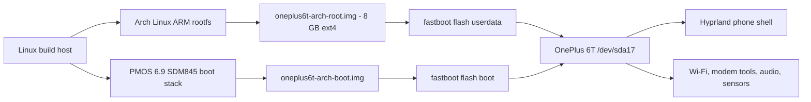

Public boot and userspace handoff:

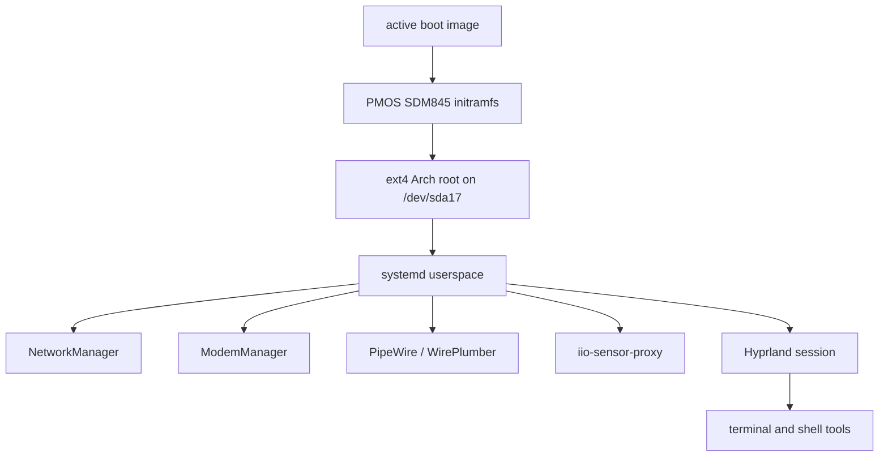

Public phone-facing service map:

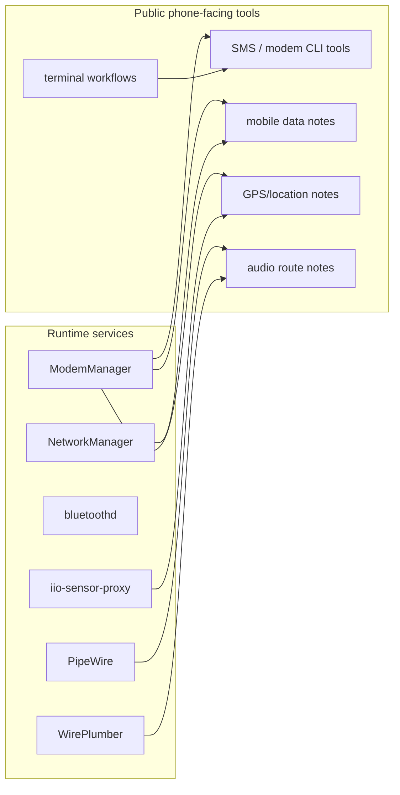

Community versus sponsored development track:

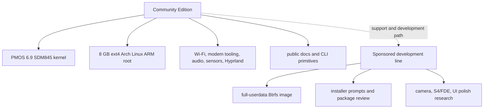

## Status At A Glance

| Area | Public community status | Public image policy |
| --- | --- | --- |
| Boot/root | Paired boot + fixed 8 GB ext4 userdata image | Ship matched pairs only |
| Display/touch | Hyprland desktop path documented for OnePlus 6T | Included |
| GPU acceleration | Freedreno/Adreno 630 runtime path present through base packages | Runtime path included; diagnostics are not the focus |
| Keyboard | Basic desktop/terminal input path; public repo keeps UI minimal | Included as community baseline |
| Launcher/terminal | Terminal-first workflow | Included |
| Rotation | Sensor backend documented; custom polish kept minimal | Basic path only |
| Wi-Fi | Qualcomm Wi-Fi firmware/service path documented | Included; no private credentials |
| Mobile data | ModemManager and APN notes available | Included as CLI/tooling path |
| Calls/SMS | Modem/SMS userspace documented; app polish not promised | Experimental/community validation |
| Audio | PipeWire/WirePlumber userspace path | Included; route polish not promised |
| Bluetooth | BlueZ userspace | Included |
| Haptics | Hardware notes/tooling path | Basic validation only |
| GPS | Modem/location notes | Needs per-device outdoor validation |
| Lock screen | Not part of community image | Excluded |
| Camera | Camera research not shipped here | Excluded |
| Suspend | s2idle notes exist | Experimental |
| S4/FDE | Design/research track only | Deferred |

## Technical Details

Experimental Arch Linux ARM image builder for the OnePlus 6T, codename `fajita`.

The goal is to produce two flashable files:

```text
oneplus6t-arch-boot.img
oneplus6t-arch-root.img
```

Target flash flow:

```text
fastboot flash boot oneplus6t-arch-boot.img
fastboot flash userdata oneplus6t-arch-root.img
```

This is not a finished phone distribution yet. It is a reproducible path from
Arch Linux ARM plus the working postmarketOS SDM845 boot stack to a bootable
Linux root filesystem on the OnePlus 6T userdata partition.

## Current Verified Prototype State

Verified on a OnePlus 6T with fastboot serial `13dab785`:

```text
boot slot: a
root: /dev/sda17
filesystem: ext4
label: archroot
uuid: 8f3b0c30-9845-451d-aed4-7e80541a0d29
kernel: 6.9.0-sdm845
ssh: alarm over USB network at 172.16.42.1
dev root escalation: su -
```

The current boot path is:

```text
boot_a -> PMOS SDM845 kernel/initramfs -> Arch Linux ARM root on /dev/sda17
```

Current hardware validation highlights:

```text
display: DSI-1 1080x2340@60 through Hyprland
GPU: Adreno A630 firmware required; Hyprland confirmed after firmware install
Wi-Fi: wlan0 present and scan-only test passed
cellular: SIM/UIM slot selected, LTE registered, PS attached, PDP data not attached
```

The current working boot image uses:

```text
quiet splash loglevel=3 systemd.show_status=false
pmos.stowaway
pmos_root_uuid=8f3b0c30-9845-451d-aed4-7e80541a0d29
pmos_root=/dev/sda17
rootfstype=ext4
```

The Arch userspace includes Plymouth with the `paw-arch-dark` theme entry to
keep normal boot quieter after the PMOS initramfs hands off to the root
filesystem. The earliest PMOS initramfs/kernel phase can still print messages
because those boot artifacts are imported, not rebuilt by this repo.

The old PMOS `pmos_boot_uuid=` must not be used with this layout. It pointed at
the old PMOS userdata boot subpartition, which is not used by this plain ext4
userdata-root layout.

## What This Repo Builds

This repo builds:

```text
out/oneplus-fajita/oneplus6t-arch-boot.img
out/oneplus-fajita/oneplus6t-arch-root.img
```

The boot image is an Android boot image made from:

```text
PMOS vmlinuz
PMOS sdm845-oneplus-fajita.dtb
PMOS initramfs
known-good OnePlus 6T mkbootimg offsets
known-good /dev/sda17 stowaway cmdline
```

The root image is a fixed 8GB ext4 image made from:

```text
Arch Linux ARM aarch64 rootfs
OnePlus 6T profile config
native packages from profiles/oneplus-fajita/packages.txt
PMOS initramfs-extra and boot artifacts copied into /boot
Plymouth userspace quiet boot configuration
profile overlay files
```

When `img2simg` is available, the raw root image is converted to Android sparse
image format so `fastboot flash userdata` is practical.

## Repository Layout

```text
profiles/oneplus-fajita/config.env       device profile and boot parameters
profiles/oneplus-fajita/overlay/         files copied into the rootfs image
scripts/build-bootimg.sh                 builds oneplus6t-arch-boot.img
scripts/build-rootfs-image.sh            builds oneplus6t-arch-root.img
scripts/build-release.sh                 runs both builders
scripts/flash-release.sh                 flashes boot and userdata as a pair
scripts/check-phone.sh                   non-destructive USB/fastboot check
scripts/resolve-profile-packages.sh      resolves/downloads the aarch64 package layer
scripts/snapshot-images.sh               saves labelled boot/root image checkpoints
vendor/pmos-oneplus-fajita/              local PMOS boot artifact staging area
image-snapshots/                         local ignored image checkpoints and manifests
docs/                                    technical notes and current map
```

Hardware feature tracking:

```text
docs/PMOS-ONEPLUS6T-FEATURE-IMPORT-MAP.md
docs/PMOS-COMPAT-QUALCOMM-SERVICES.md
docs/PHONE-CONTROLS-HYPRLAND.md
docs/MOBILE-DATA-SIM-SLOTS.md
docs/PMOS-WORKS-FEATURE-CHECKLIST.md
docs/NATIVE-USERSPACE-PACKAGES.md
docs/DEVICE-PROFILE-CONTRACT.md
docs/IMAGE-SNAPSHOT-WORKFLOW.md
```

Generated images, caches, and vendor boot artifacts are ignored by git.

## Host Requirements

Build host:

```text
Linux
bash
curl
tar
rsync
mkfs.ext4
mount/umount
mkbootimg
img2simg
fastboot
sha256sum
pacman
```

The root image builder must run as root because it creates and mounts an ext4
filesystem image.

On Arch Linux, the likely packages are:

```text
android-tools
e2fsprogs
curl
rsync
zstd
```

Package names differ on other distributions.

## PMOS Boot Artifacts

This project currently depends on the postmarketOS SDM845 OnePlus 6T boot stack.

Before building, place the working PMOS boot artifacts here:

```text
vendor/pmos-oneplus-fajita/boot/
```

Expected files:

```text
vmlinuz
initramfs
initramfs-extra
sdm845-oneplus-fajita.dtb
linux.efi
boot.img
```

These files are intentionally not stored in git.

## Build Configuration

Main profile:

```text
profiles/oneplus-fajita/config.env
```

Important defaults:

```text
ROOT_DEVICE=/dev/sda17
ROOT_LABEL=archroot
ROOT_UUID=8f3b0c30-9845-451d-aed4-7e80541a0d29
ROOT_IMAGE_SIZE=8G
ROOT_FSTYPE=ext4
ARCHLINUXARM_ROOTFS_URL=http://os.archlinuxarm.org/os/ArchLinuxARM-aarch64-latest.tar.gz
INSTALL_PROFILE_PACKAGES=1
```

The URL points at the Arch Linux ARM aarch64 latest rootfs. For reproducible
releases, pin and checksum a specific downloaded tarball instead of relying only
on the moving latest URL.

## Build Boot Image

Builds:

```text
out/oneplus-fajita/oneplus6t-arch-boot.img
out/oneplus-fajita/oneplus6t-arch-boot.img.sha256
```

Script:

```text
scripts/build-bootimg.sh
```

## Build Root Image

Builds:

```text
out/oneplus-fajita/oneplus6t-arch-root.raw.img
out/oneplus-fajita/oneplus6t-arch-root.img
out/oneplus-fajita/oneplus6t-arch-root.img.sha256
```

Script:

```text
scripts/build-rootfs-image.sh
```

The sparse `.img` is the intended fastboot artifact. The raw image is kept as a
debug/build intermediate.

The builder writes this `/etc/fstab` into the image:

```text
UUID=8f3b0c30-9845-451d-aed4-7e80541a0d29 / ext4 rw,noatime 0 1
```

Community Edition keeps this image fixed-size and ext4. It does not include the
full-userdata resize path.

It also copies PMOS files to top-level `/boot` because PMOS initramfs expects:

```text
/boot/initramfs
/boot/initramfs-extra
/boot/vmlinuz
/boot/sdm845-oneplus-fajita.dtb
```

By default it also installs the package manifest into the mounted image:

```text
profiles/oneplus-fajita/packages.txt
```

This is how the generated root image gets Hyprland, Qualcomm firmware packages,
audio services, Bluetooth userspace, sensor services, and modem userspace. Set
`INSTALL_PROFILE_PACKAGES=0` only for low-level boot debugging.

For future device ports, keep device-specific boot parameters, firmware,
services, desktop controls, and validation evidence inside the device profile.
See:

```text
docs/DEVICE-PROFILE-CONTRACT.md
```

## Build Full Release

Script:

```text
scripts/build-release.sh
```

This runs both builders and leaves release artifacts under:

```text
out/oneplus-fajita/
```

## Flashing

Warning: flashing userdata erases the phone's userdata partition.

Expected public release flash shape:

```text
fastboot flash boot oneplus6t-arch-boot.img
fastboot flash userdata oneplus6t-arch-root.img
fastboot reboot
```

Do not flash only `userdata` when the root partition, UUID, or PMOS cmdline has
changed. The boot image and root image are a matched pair: the boot image tells
the PMOS initramfs to mount `/dev/sda17` with UUID
`8f3b0c30-9845-451d-aed4-7e80541a0d29`.

The scripted local path is:

```text
CONFIRM_FLASH=1 scripts/flash-release.sh oneplus-fajita
```

Use `scripts/check-phone.sh` first to confirm the host can see the phone in the
expected mode.

## First Boot And Access

The local prototype used root SSH over USB networking:

```text
phone: 172.16.42.1
host: 172.16.42.2
```

Public releases should not ship a permanent default password. The builder keeps
password login disabled unless explicitly told to create a throwaway local test
image with:

```text
ALLOW_INSECURE_DEFAULT_PASSWORD=1
```

The long-term public path should be SSH-key onboarding or a first-boot setup
flow.

## Recovery Method

A proven rescue method exists:

```text
docs/ONEPLUS6T-SELF-CONTAINED-RESCUE-BOOT.md
```

The short version:

1. Build a self-contained boot image that carries `initramfs-extra` inside the
   Android ramdisk.
2. Use `pmos.stowaway`.
3. Do not include the erased old `pmos_boot_uuid`.
4. Boot the old `/dev/sda14` Arch rescue root.
5. Repair `/dev/sda17` from there.

This recovered the prototype after `/dev/sda17` had been converted away from
the old PMOS boot subpartition layout.

## Current Limitations

This is not finished step 8 yet.

Still required before a public release should be promoted:

```text
clean-build test of oneplus6t-arch-root.img
fixed 8GB ext4 root image validation
SSH-key onboarding instead of password login
Hyprland/mobile UI package manifest clean-build confirmation
touch validation
sensor backend validation without custom compositor auto-rotate
GPU acceleration validation beyond node presence
Wi-Fi association/DHCP/reboot persistence validation
Bluetooth validation
cellular stack validation with SIM and APN
audio and microphone validation
suspend/resume and charging validation
USB-C dock/display validation
rollback and recovery instructions
release checksums and signatures
```

## Safety Notes

Do not wipe or flash random partitions.

Current Linux-owned partitions on the prototype:

```text
/dev/sda14  old rescue/bootstrap Arch root
/dev/sda17  main Arch root
/dev/sde11  boot_a
```

Treat these as dangerous:

```text
/dev/sdb*
/dev/sdc*
/dev/sdd*
/dev/sde* except deliberate boot_a writes
/dev/sdf*
/dev/sda1 through /dev/sda13
/dev/sda15
/dev/sda16
```

See:

```text
docs/ONEPLUS6T-PARTITION-MAP.md
```

## Project Direction

This repo is the practical installer/build side of the broader Linux phone
project. The OnePlus 6T is a reproducible community proving ground for open
mobile Linux: boot images, root filesystem generation, hardware notes, recovery
instructions, and a transparent build process.

Future-product planning are intentionally kept
out of this repository. This tree stays focused on the installable community
edition and the technical notes needed to understand it.
